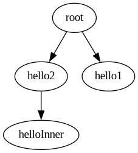
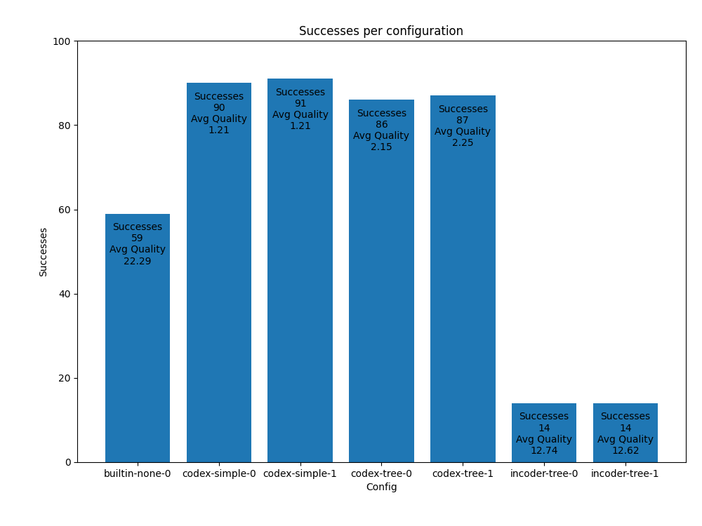

# Abstract

Type inference for gradually-typed languages such as TypeScript and Python has become increasingly prevalent in the field of programming languages. However, current approaches often struggle with inferring descriptive types in cases in which user-defined type annotations are absent, especially when inferring function signatures. In our dataset, we found that TypeScript's inference procedure was only able to correctly type-infer 59% of the given files. Furthermore, we found that the quality of the type annotations was low, as the types were too permissive, possibly leading to an increased number of dynamic type errors. This finding makes the built-in procedure ineffective in practice. In this report, we show an effective use of large natural language models to aid these type inference procedures. Our approach utilizes static insertion of type holes to generate a prompt to be edited by a language model. Our paper mainly uses Codex's _code-davinci-edit_ model for TypeScript type inference. Additionally, we also explore other languages such as Python and other language models such as Facebook's _InCoder_ model. Across our dataset, we were able to type-infer 91% of the files with descriptive, high quality type annotations.

\newpage

# Introduction

### Motivating Example and Problem

Given this untyped file,

```ts
const kClosest = (points, K) => {
  let len = points.length,
    l = 0,
    r = len - 1
  while (l <= r) {
    let mid = helper(points, l, r)
    if (mid === K) break
    if (mid < K) {
      l = mid + 1
    } else {
      r = mid - 1
    }
  }
  return points.slice(0, K)
}

function helper(A, l, r) {
  ... // omitted for length (uses compare on an element of A)
}

function compare(p1, p2) {
    return p1[0] * p1[0] + p1[1] * p1[1] - p2[0] * p2[0] - p2[1] * p2[1];
}
```

TypeScript's inference procedure gives this completion:

```ts
const kClosest: (
  points: any,
  K: any
) => any = (points, K) => {
  let len: any = points.length,
    l: number = 0,
    r: number = len - 1;
  while (l <= r) {
    let mid: any = helper(points, l, r);
    ... // omitted for length
  }
};

function helper(A: any, l: any, r: any): any;

function compare(p1: any, p2: any): number;
```

While the completion from TypeScript's inference procedure may successfully type check, it is important to note the overuse of the `any` type annotation. For example, note the `any` annotation for the `points` parameter. On the first line of the function, `points.length` is being accessed. Given the context, it would seem rational to type-annotate `points` with `any[]`. However, consider the case that the `kClosest` function is given `{ length: 3 }` as the `points` argument. Clearly, `{ length: 3 }` is not an `any[]`. However, a deterministic type inference procedure must consider this case. Therefore, annotating the `points` argument with `any` is the most rational decision in this case. This problem motivates the use of a probabilistic approach to overcome similar cases.

As an initial approach, we could try feeding the program to a natural language model that is able to make edits on the prompt. We would instruct the model to insert type annotations on the given untyped TypeScript program. The model would then output a set of completions that _may_ type-check. Then, we would run type-checks on each completion to find ones that pass the checks.

# Implementation

### Simple Implementation

We have employed the approach described above in the following manner:

1. We insert the identifier `_hole_` in place of missing types in our input JavaScript program. To do this, we use a compiler $\mathcal{K} : \text{File} \rightarrow \mathcal{P}$.
2. We define an instruction $\mathcal{I}$, which is the constant string:  
   $\mathcal{I} = \text{"Substitute the identifier \_hole\_ with the correct type."}$
3. We query the `davinci-edit` model using the compiled prompt $\mathcal{P}$ and instruction $\mathcal{I}$. We receive back a set of completions $\mathcal{C}$, $0 \leq |\mathcal{C}| \leq n$, where $n$ is a pre-defined maximum number of completions.
4. We use a cheap and admissible heuristic $h : c \rightarrow (\text{Boolean},\ \mathcal{N})$ that determines if a given completion $c$ is _correct_ (a _correct_ completion however, may still not type-check) and the quality of the type annotations $q$, where the lower the $q$ the better.
5. We apply $h$ to all elements in $\mathcal{C}$ and we add the completions that produced $\text{True}$ to an ordered set $\mathcal{Q}$ sorted by $q$.
6. Using the command: `tsc --allowJs --checkJs --noEmit --target es2022 <file.ts>` we run a full type-check on every completion in $\mathcal{Q}$, terminating as soon as the command returns code `0`, meaning that the completion is type-correct. By terminating early on the sorted set, we guarantee that our solution is optimal with respect to $\mathcal{Q}$. We let $c^*$ be the optimal type-correct solution.
7. We produce $c^*$ if it exists, otherwise we produce an error.

Using this strategy, we were able to type-infer our motivating example as such:

```ts
const kClosest: (
  points: [number, number][],
  K: number
) => [number, number][] = (points, K) => {
  let len: number = points.length,
    l: number = 0,
    r: number = len - 1;
  while (l <= r) {
    let mid: number = helper(points, l, r);
    ... // omitted for length
  }
};

function helper(A: [number, number][], l: number, r: number): number;

function compare(p1: [number, number], p2: [number, number]): number;
```

We believe that these types are as descriptive as they can get. The `compare` function ever only accesses the first two elements of `p1` and `p2`, therefore a pair type is a good choice.

However, this approach does not scale for large input sizes, such as larger functions or files for several reasons. First, the Codex model has a maximum input token limit of 2048 tokens. Second, the quality of the infilled type annotations declines as the size of the completion context increases.

### Scalable Prompt Engineering Implementation

An obvious approach to solve this problem is to simply split the original program into chunks, which are then sent to the Codex model. Then, these completed chunks would be reassembled to compose a set of candidate completions. A systematic way of chunking the original program is to create a tree of code blocks in which each level represents an inner scope of the level above. Given this approach, it is important to note that we lose context of other code blocks that may be referenced in the current code block. To alleviate this problem, we include signatures of the child scopes in the current scope. Additionally, we include usages of identifiers that defined in the current scope and are used in other scopes. Our step-by-step algorithm is explained below:

- 1. We create a tree of nested code-blocks $T$ in our JavaScript program. Where the top-level is the root of the tree and each function, class or method has a node below the parent block. The node of the tree is identified by $\text{id-}\alpha$, the $\alpha$-renamed name of the function/class/method. The root node id is defined as $\text{id-}\alpha = root$.
- 2. For each $\text{id-}\alpha$, we find usages of the identifier and we save them in the node for prompt-engineering purposes.
- 3. We start traversing the tree using a bottom-up traversal, starting from the leaves. We process each level in parallel. To each node we apply the steps described below:
  - 1. If the current node is not a leaf node, we extract the completions for all the direct children of this node and then type-weave the types of the children into this node. This process creates permutations for all completions of all direct children of this node. For each permutation, we create a prompt $\mathcal{P}_i$. We use the type-weaving procedure:  
       $\mathcal{W}: \text{Original File, Nettle File} \rightarrow \text{Resulting File}$.
  - 2. For each prompt, we insert the saved usages of $\text{id-}\alpha$ at the bottom of the prompt, to help Codex infer the types.
  - 3. For each prompt, we insert the identifier `_hole_` in place of missing types in our prompts. To do this, we use a compiler $\mathcal{K} : \text{File} \rightarrow \mathcal{P}$.
  - 4. We define an instruction $\mathcal{I}$, which is the constant string:  
       $\mathcal{I} = \text{"Substitute the identifier \_hole\_ with the correct type."}$
  - 5. For each prompt computed for the node, query the `davinci-edit` or `incoder` model using the prompt $\mathcal{P}_i$ and instruction $\mathcal{I}$. We receive back a set of completions $\mathcal{C}_{\text{id-}\alpha}$, $0 \leq |\mathcal{C}_{\text{id-}\alpha}| \leq n$, where $n$ is a pre-defined maximum number of completions.
  - 6. We use a cheap and admissible heuristic $h : c \rightarrow (\text{Boolean},\ \mathcal{N})$ that determines if a given completion $c$ is _correct_ (a _correct_ completion however, may still not type-check) and the quality of the type annotations $q$, where the lower the $q$ the better.
  - 7. We apply $h$ to all elements in $\mathcal{C}_{\text{id-}\alpha}$ and add the completions that produced $\text{True}$ to an ordered set $\mathcal{Q}_{\text{id-}\alpha}$ sorted by $q$.
- 4. Using the command: `tsc --allowJs --checkJs --noEmit --target es2022 <file.ts>` we run a full type-check test on every completion in $\mathcal{Q}_{root}$, terminating as soon as the command returns code `0`, meaning that the completion is type-correct. By terminating early on the sorted set, we guarantee that our solution is optimal with respect to $\mathcal{Q}_\text{root}$. We let $c^*$ be the optimal type-correct solution.
- 5. We produce $c^*$ if it exists, otherwise we produce an error.

### Implementation Components

#### Compiler

We have implemented $\mathcal{K}$ by interfacing with the TypeScript compiler API for inserting type-holes into identifiers that lack type annotations.

For instance, given this input:

```ts
function hello(name: string) {
  let msg = "Hello";
  return msg + ", " + name + "!";
}
```

$\mathcal{K}$ will output the following:

```ts
function hello(name: string): _hole_ {
  let msg: _hole_ = "Hello";
  return msg + ", " + name + "!";
}
```

#### Completion Validation Heuristic

We have implemented our heuristic $h$. The heuristic traverses the program's abstract syntax tree identifying different types, which will be scored. Some types terminate the heuristic early and denote that the program cannot possibly be correct. The scores are summed to compose $q$ using the following table:

| Type                                     | Score | Correct          |
| ---------------------------------------- | ----- | ---------------- |
| _missing_ (example: `let x = 1`)         | +0    | False, terminate |
| _literal type_ (example: `let x: 3 = 1`) | +0    | False, terminate |
| `_hole_`                                 | +0    | False, terminate |
| `unknown`                                | +10   | True, continue   |
| `any`                                    | +5    | True, continue   |
| `undefined`                              | +2    | True, continue   |
| `Function` (interface type)              | +5    | True, continue   |

For example, with the completion:

```ts
function hello(name: string): any {
  let msg: undefined = "Hello";
  return msg + ", " + name + "!";
}
```

$h$ will output $(\text{True}, 7)$, as the presence of one `any` and `undefined` gives a summed score of $5 + 2 = 7$

While, with the completion:

```ts
function hello(name: string): _hole_ {
  let msg: string = "Hello";
  return msg + ", " + name + "!";
}
```

$h$ will terminate early and output $(\text{False}, 0)$, as the presence of one `_hole_` type terminates the heuristic early.

Additionally, $h$ checks if the model didn't add anything other than just types (such as additonal code blocks and comments) to the original prompt. If that condition isn't met, $(\text{False}, 0)$ will be produced.

#### Initial Tree Generation

We have implemented a procedure $M$ that generates a code-block tree from a given program.

For instance, given this input:

```ts
function hello2(name) {
  const helloInner = (name) => {
    return "Hello " + name;
  };
  return helloInner(name);
}

const hello1 = (name) => {
  return "Hello " + name;
};
```

The procedure is going to output:  
{ width=100px }

Where each node in the tree is annotated using the definition:

```rs
pub struct CompNode {
  pub children_idxs: Vec<usize>, // pointers to the children
  pub name: String, // the alpha-renamed id
  pub code: String, // the code of this node
  pub completed: Vec<String>, // the completions of this node (starts empty)
  pub usages: String, // the usages of the alpha-renamed id of this node
}
```

#### Type-Weaving Procedure

We have implemented a type-weaving procedure $\mathcal{W}$. This procedure is used to transplant
the type-annotations from one program to another without being affected by structural differences
in either programs. The procedure uses scope-based $\alpha$-renaming in order to extract
the types from matching identifiers in different scopes. This gives us fine-grained control
for selecting which scopes should have types extracted and which scopes should not.

For instance, the given program:

```ts
function hello(name: string): string {
  function inner(): string {
    let my_string: string = "Hello " + name;
    return my_string;
  }
  return inner();
}
```

Has the following $\alpha$-renamed type-table:

| $\alpha$-renamed id     | Type                       |
| ----------------------- | -------------------------- |
| `hello`                 | `(name: string) => string` |
| `hello$inner`           | `() => string`             |
| `hello$inner$my_string` | `string`                   |

Using this program as our _nettle_ (the reference program that donates types to be transplanted),
we can transplant types into the following program, starting from scope `hello`:

```ts
function hello(name) {
  function inner() {
    let my_string = "Hello " + name;
    return my_string;
  }
  return inner();
}
```

We will receive back the program:

```ts
function hello(name) {
  function inner(): string {
    let my_string: string = "Hello " + name;
    return my_string;
  }
  return inner();
}
```

This allows us to ignore any types given to the `hello` function, while transplanting types given to
the `hello$inner` function and the `hello$inner$my_string` variable.

#### Client

Finally, we have implemented a client in Rust that manages the pipeline and queries the Codex API. The client will communicate with the compiler $K$, which is written in TypeScript and will send the outputs to Codex. The client can be downloaded from [https://github.com/GammaTauAI/opentau](https://github.com/GammaTauAI/opentau) and can be utilized by using the following terminal interface:

```
USAGE:
    client [OPTIONS] --tokens <TOKENS> --file <FILE> --output <OUTPUT>

OPTIONS:
    -c, --cache <CACHE>          The Redis URL for the cache
        --disable-rate-limit     Whether or not to prevent rate limits.
                                 You may want to set this to false if you are using
                                 your own model. By default, we try to
                                 prevent rate limits, by using this
                                 flag you can disable this behavior
    -e, --endpoint <ENDPOINT>    The url of the codex endpoint [default:
                                 https://api.openai.com/v1/edits]
    -f, --file <FILE>            The target file path
        --fallback               Whether to fallback to "any" or not
    -h, --help                   Print help information
    -l, --lang <LANG>            The target language. Either `ts` or `py` [default: ts]
    -n, --n <N>                  The number of completions to return [default: 3]
    -o, --output <OUTPUT>        Output file directory path
    -r, --retries <RETRIES>      The number of request to send to Codex [default: 1]
    -s, --strategy <STRATEGY>    Completion strategy. Either: {"simple": simple completion,
                                "tree": tree completion} [default: simple]
        --stop-at <STOP_AT>      The maximum number of type-checkable completions to return
                                 [default: 1]
    -t, --tokens <TOKENS>        Codex tokens to use, separated by commas
        --temp <TEMP>            The temperature to use for the completion [default: 1]
    -V, --version                Print version information
```

Type-correct solutions will be written to the specified directory.

#### Language Server Protocol

We have developed a protocol similar to Microsoft's LSP, that allows to generalize our type inference strategies
for any language server that implements $\mathcal{K}$, $h$, $\mathcal{W}$ and the tree generation procedure. The protocol expects communication using
JSON over Unix domain sockets. A client for the protocol is implemented in the Rust client described above.
Adding a new server for the protocol is as simple as implementing the `LangServer` trait in the Rust client.
The server needs to be designed with concurrent requests in mind as the `tree` strategy queries each node of the current
level of the tree in parallel.
Our TypeScript and Python language servers implement such protocol.

### Building Our Own Codex

One limitation with using Codex is the max request limit of 20 requests per minute. To solve this issue, we tried to utilize a different model that we could self host. We decided to use Facebook's InCoder model as it was the only other model that is trained to provide prompt edit completions on code.

The InCoder model query system was implemented as a simple HTTP server that evaluates the
InCoder model $M$ and receives an untyped input and several hyperparameters from the language
server and returns a list of type infills. Then, the type infills are inserted into the
original untyped code to yield the final completion. The pipeline is shown below:

Given the following prompt $\mathcal{P}$: we have the untyped input

```ts
function hello(name: _hole_): _hole_ {
  let msg: string = "Hello";
  return msg + ", " + name + "!";
}
```

and the hyperparameters `max_to_generate=5`, `temperature=0.8`, and `max_retries=1` in a POST request, the server will split the input by the fake type, `_hole_` to yield the following list:

```ts
parts_list = [
  "function hello(name: ",
  "): ",
  ' { let msg: string = "Hello"; return msg + ", " + name + "!";}',
];
```

The `parts_list` and the given hyperparameters will form prompt $\mathcal{P}$' and will be given to $M$ for the `infill` task. $M$($\mathcal{P}$') will yield a list of inferred types, such as

```ts
type_list = ["string", "string"];
```

Then, the `type_list` will be inserted into the original `parts_list` to build the final completion:

```ts
function hello(name: string): string {
  let msg: string = "Hello";
  return msg + ", " + name + "!";
}
```

The describes process will execute $N$ number of times where $N$ is the number of requested completions.
Finally, the InCoder server will return the following JSON response:

```json
{
  "choices": [
    "text": "<completion0>",
    "text": "<completion1>",
    ...
    "text": "<completionN>"
  ]
}
```

where `choices` is of length $N$.

This API mimics the Codex API in order to be an effective drop-in replacement, all we had to do in our client is changing the url.

In production, we execute the InCoder model on NVIDIA A100 GPUs using Northeastern's Discovery Cluster.

# Dataset, Evaluation and Results

#### Dataset

We randomly picked 100 files from a dataset composed of 1934 small to medium-sized JavaScript Leetcode solutions. First, we converted the JavaScript files to TypeScript files and then manually validated every file to ensure that there exists a type checkable solution. This includes linting the untyped files and scanning for logical errors.

#### Evaluation

We employed a best-of-3 evaluation approach in which we ran each configuration of our client three times and saved the best outcome. We run both the simple and tree strategy with Codex using temperatures of 0.8 and 1.0. We also test InCoder using the tree strategy with temperatures of 0.8 and 1.0. The results are shown in **Figure 1** below.

{ width=550px }

# Discussion and Future Directions

### Discussion

Using a combination of prompt engineering and Codex's `code-davinci-edit` model, we were able to effectively type-infer a medium-sized dataset of TypeScript files. Across all of our experimental dataset, we were able to type-infer 91% of the files with descriptive, high quality type annotations. Furthermore, we were able to observe a significant improvement in the quality of the type annotations, as the types were more descriptive and restrictive than the type annotations inferred by TypeScript's built-in type inference procedure. Additionally, we explored other languages such as Python and other language models such as Facebook's `InCoder` model. We found that the results from `InCoder` were significantly worse than those from Codex, likely due to the model not being trained on typed code.

### Future Directions

One limitation of our approach is the reliance on a commercial product, Codex, which may render our approach expensive and infeasible for an individual or a small research group to use. However, our work also explored the use of an open-source language model, `InCoder`, as a replacement for Codex. While the results from `InCoder` were not as good as those from Codex, with further fine-tuning, the model could be used as an effective replacement for Codex, allowing our approach to be used by individuals and small research groups. Additionally, thanks to our language server protocol, our approach could be extended to other programming languages, such as Rust and Java, by training a language model on the task of type inference for these languages.

# TODO:

- Analyze results (expectation, reflection) (Noah)
  - incoder bad
  - talk about quality metric
- Bar graph for accuracy of strategy vs lines of code (Noah)
- Python evaluation (Noah)
